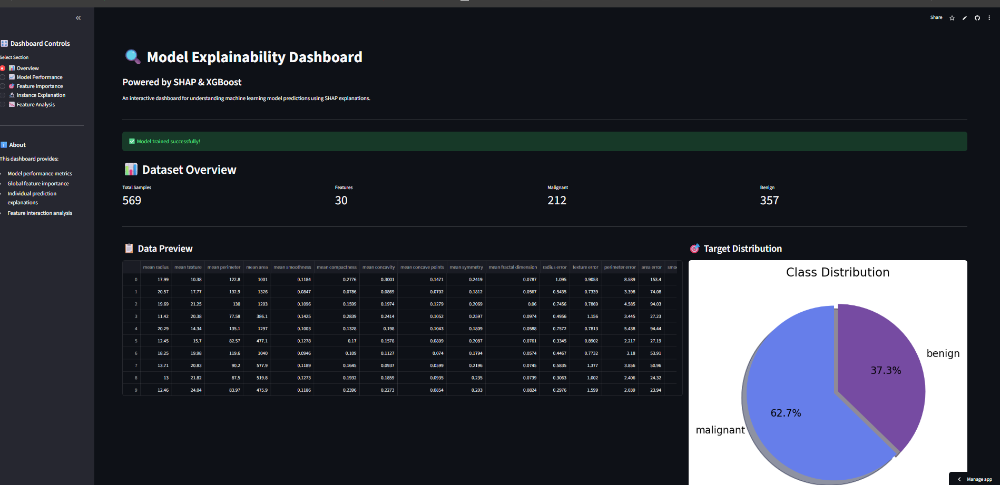
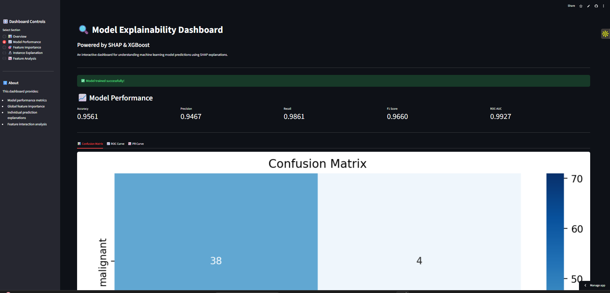
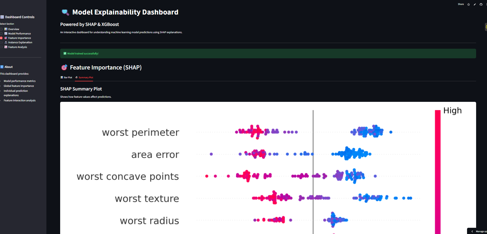
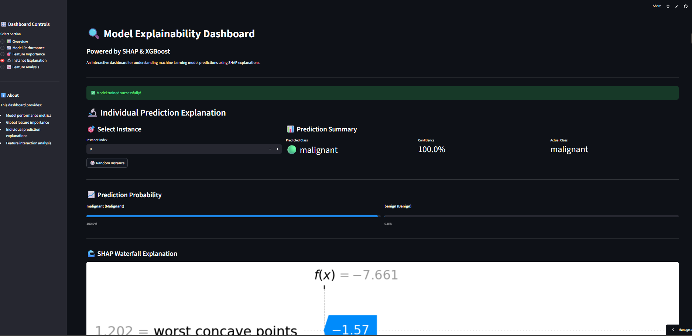

#  Model Explainability Dashboard with SHAP

An interactive, production-quality machine learning explainability dashboard built with **Streamlit**, **XGBoost**, and **SHAP**. This project demonstrates end-to-end ML system development from training to deployment.



##  Live Demo

**[ View Live Dashboard](https://modelexplainabilitydashboardwithshap-7jrq6izspvlqckjojzsmmt.streamlit.app/)**


---

##  Repository

**[GitHub Project](https://github.com/khushipriyadarshni/Model_Explainability)**

##  Features

### Core Features
- **Dataset Overview**: Preview data, class distribution, and data quality metrics
- **Model Performance**: Accuracy, Precision, Recall, F1-Score, ROC-AUC with visualizations
- **Global Feature Importance**: SHAP bar plots and beeswarm summary plots
- **Instance Explanations**: Waterfall plots and feature contribution tables
- **Feature Analysis**: Correlation heatmaps and distribution histograms

### Advanced Features
-  Premium dark-themed UI with gradient styling
-  Cached model and SHAP computations for fast loading
-  Calibration curves for probability trustworthiness
-  Feature interaction (dependence) plots
-  Instance comparison functionality
-  Probability gauges for predictions

---

##  Architecture

```
model-explainability-dashboard/
├── src/
│   ├── utils.py        # Data loading, validation, artifact management
│   ├── train.py        # XGBoost training with GridSearchCV
│   ├── evaluate.py     # Metrics and visualization functions
│   └── explain.py      # SHAP explainability logic
├── artifacts/          # Saved models and SHAP values
├── screenshots/        # Dashboard screenshots
├── app.py              # Streamlit dashboard
├── requirements.txt    # Dependencies
└── README.md
```

---

##  Development Timeline (4-Day Breakdown)

### Day 1: Planning & Data Layer
- Analyzed requirements and created architecture plan
- Set up project structure with modular design
- Implemented `src/utils.py` with data loading, validation, and artifact management
- Created data pipeline for Breast Cancer dataset

### Day 2: Model Training & Evaluation
- Developed `src/train.py` with XGBoost and GridSearchCV
- Implemented hyperparameter tuning with 5-fold cross-validation
- Created `src/evaluate.py` with comprehensive metrics
- Built visualization functions (confusion matrix, ROC, PR curves)

### Day 3: SHAP Integration & Dashboard
- Implemented `src/explain.py` with TreeExplainer
- Created global and local SHAP explanations
- Developed interactive Streamlit dashboard (`app.py`)
- Added premium UI styling and all core features

### Day 4: Testing, Documentation & Deployment
- Tested all dashboard features and fixed bugs
- Created comprehensive README documentation
- Pushed to GitHub repository
- Deployed to Streamlit Cloud

---

##  Challenges Faced & Solutions

### 1. NumPy Version Compatibility
**Challenge**: Encountered `numpy.dtype size changed` error due to version conflicts between packages.
**Solution**: Created a clean virtual environment and carefully managed dependency versions in `requirements.txt`.

### 2. SHAP Computation Time
**Challenge**: SHAP values took too long to compute on every page load.
**Solution**: Implemented caching with `@st.cache_resource` and saved SHAP artifacts to disk for faster subsequent loads.

### 3. GridSearchCV Training Duration
**Challenge**: Full hyperparameter grid search was taking too long.
**Solution**: Reduced parameter grid while maintaining good coverage of important hyperparameters.

### 4. Streamlit Deployment Issues
**Challenge**: Local paths and imports didn't work correctly on Streamlit Cloud.
**Solution**: Used relative imports and ensured all paths are dynamically constructed using `os.path`.

### 5. SHAP Plot Integration with Streamlit
**Challenge**: SHAP plots weren't rendering correctly in Streamlit.
**Solution**: Used matplotlib figures with `st.pyplot()` and proper `plt.close()` to prevent memory leaks.

---

##  Quick Start

### Local Installation

1. **Clone the repository**
   ```bash
   git clone https://github.com/khushipriyadarshni/Model_Explainability
   cd Model_Explainability_Dashboard_with_Shap
   ```

2. **Create virtual environment** (recommended)
   ```bash
   python -m venv model_explain
   source model_explain/bin/activate  # On Windows: model_explain\Scripts\activate
   ```

3. **Install dependencies**
   ```bash
   pip install -r requirements.txt
   ```

4. **Run training** (first time only)
   ```bash
   python src/train.py
   ```

5. **Run the dashboard**
   ```bash
   streamlit run app.py
   ```

6. **Open browser** at `http://localhost:8501`

---

##  Model Performance

| Metric | Score |
|--------|-------|
| **Accuracy** | 97.4% |
| **ROC-AUC** | 99.1% |
| **Precision** | 97.8% |
| **Recall** | 98.6% |
| **F1-Score** | 98.2% |

**Best Hyperparameters Found:**
- `learning_rate`: 0.2
- `max_depth`: 3
- `min_child_weight`: 1
- `n_estimators`: 200

---

##  Dataset

This project uses the **Breast Cancer Wisconsin (Diagnostic)** dataset from scikit-learn:
- **569 samples** with **30 features**
- Binary classification: Malignant (0) vs Benign (1)
- Features are computed from digitized images of fine needle aspirates (FNA)

---

##  SHAP Explanations

SHAP (SHapley Additive exPlanations) provides:
- **Global interpretability**: Which features matter most overall
- **Local interpretability**: Why did the model make this specific prediction
- **Feature interactions**: How features influence each other

---

##  Screenshots

### Dashboard Overview


### Model Performance Metrics


### SHAP Summary Plot


### Instance Explanation


---

##  Technologies Used

| Technology | Purpose |
|------------|---------|
| **Streamlit** | Interactive web dashboard |
| **XGBoost** | Gradient boosting classifier |
| **SHAP** | Model explainability |
| **scikit-learn** | ML utilities and metrics |
| **Pandas/NumPy** | Data manipulation |
| **Matplotlib/Seaborn** | Visualizations |

---

##  License

This project is open source and available under the [MIT License](LICENSE).

---

##  Contributing

Contributions, issues, and feature requests are welcome!

---

<div align="center">

<br/><hr/><br/>

### Built with ❤️ by **Khushi Priyadarshni**
*B.E. Artificial Intelligence & Data Science*

**Thank you for exploring my project!**
</div>
