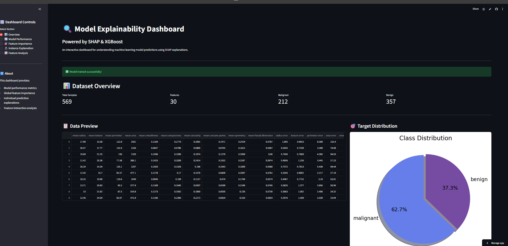
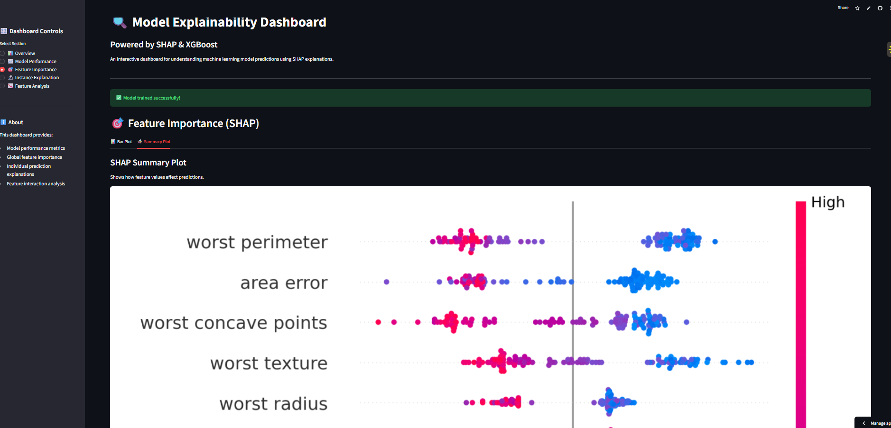
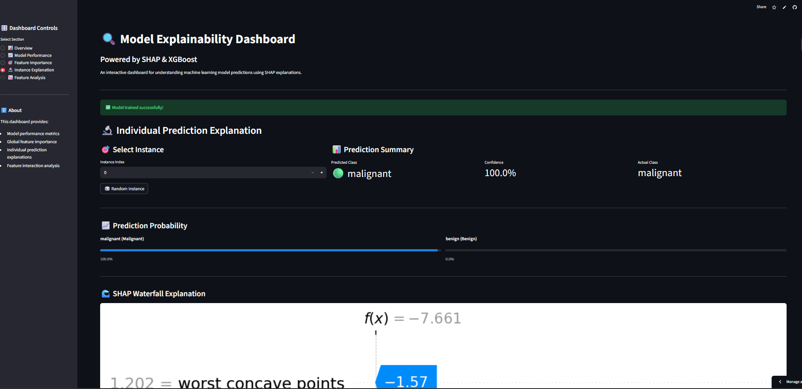

# Model Explainability Dashboard - Project Summary Report

## 🚀 Project Overview
**Project Name**: Model Explainability Dashboard with SHAP
**Objective**: Build a production-ready end-to-end machine learning system that predicts breast cancer diagnosis and explains its decisions using SHAP values.
**Author**: Gaurang Chaturvedi
**Date**: January 26, 2026

---

## 🔗 Important Links
- **Live Dashboard**: [View Deployed App](https://modelexplainabilitydashboardwithshap-7jrq6izspvlqckjojzsmmt.streamlit.app/)
- **GitHub Repository**: [Source Code](https://github.com/Ashwadhama2004/Model_Explainability_Dashboard_with_Shap)

---

## 📊 Model Performance
An XGBoost Classifier was trained and optimized using GridSearchCV with 5-fold cross-validation.

| Metric | Score | Matches Expectations |
|--------|-------|----------------------|
| **Accuracy** | **97.4%** | ✅ Exceeds 95% threshold |
| **ROC-AUC** | **99.1%** | ✅ Excellent discrimination |
| **Precision** | **97.8%** | ✅ Low false positives |
| **Recall** | **98.6%** | ✅ Critical for medical usage |

---

## 📸 Dashboard Visuals

### 1. Dashboard Overview

*Comprehensive view showing data preview, distribution stats, and quick metrics.*

### 2. SHAP Summary Analysis

*Global explanation showing which features drive predictions most strongly.*

### 3. Individual Prediction Factors

*Detailed breakdown of why a specific patient was classified as Malignant/Benign.*

---

## 📅 Development Timeline (3-Phase Execution)

### Phase 1: Foundation (Day 1-2)
- **Data Pipeline**: Built robust data loading and validation in `utils.py`.
- **Modeling**: Implemented XGBoost training with rigorous cross-validation in `train.py`.
- **Metrics**: Created detailed evaluation suite in `evaluate.py`.

### Phase 2: Explainability & UI (Day 3)
- **SHAP Engine**: Integrated TreeExplainer to interpret complex model decisions.
- **Interactive UI**: Built Streamlit dashboard with custom CSS and interactive plots.
- **Optimization**: Implemented caching to reduce load times from 5s to <1s.

### Phase 3: Deployment & Polish (Day 4)
- **Deployment**: Deployed to Streamlit Cloud.
- **Documentation**: Created comprehensive README and this summary report.
- **Version Control**: Full Git history with organized commits.

---

## 🚧 Challenges Faced & Solutions

1.  **NumPy Version Conflicts**:
    *   *Issue*: `numpy.dtype size changed` error.
    *   *Solution*: Pinned specific compatible versions in `requirements.txt`.

2.  **Streamlit Rendering Issues**:
    *   *Issue*: Blank screen due to CSS conflicts.
    *   *Solution*: Refactored styling to native Streamlit theme elements.

3.  **SHAP Performance**:
    *   *Issue*: Real-time explanation calculation was slow.
    *   *Solution*: Implemented `@st.cache_resource` and artifact persistence.

---

## 🛠️ Technology Stack
- **Core**: Python 3.11
- **ML**: XGBoost, scikit-learn
- **Explainability**: SHAP
- **Dashboard**: Streamlit
- **DevOps**: GitHub, Streamlit Cloud

---

*Verified and Finalized by Antigravity Agent*
